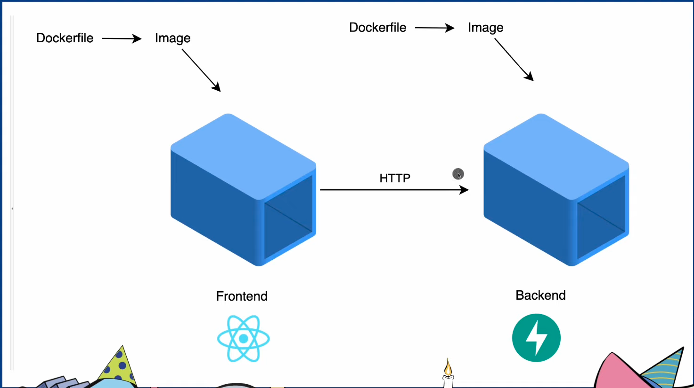
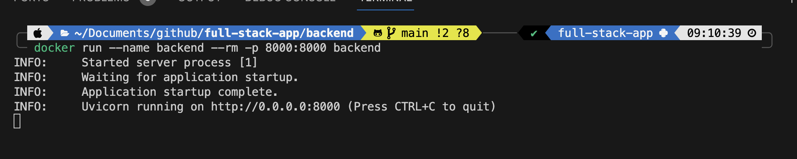
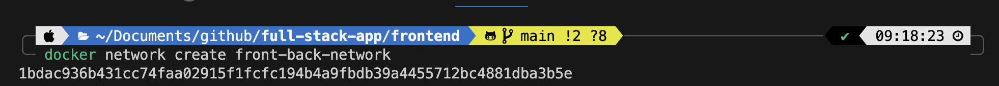
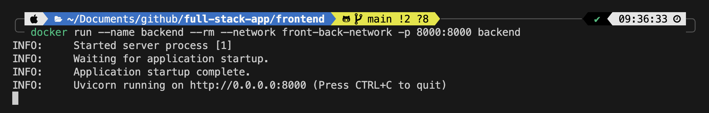
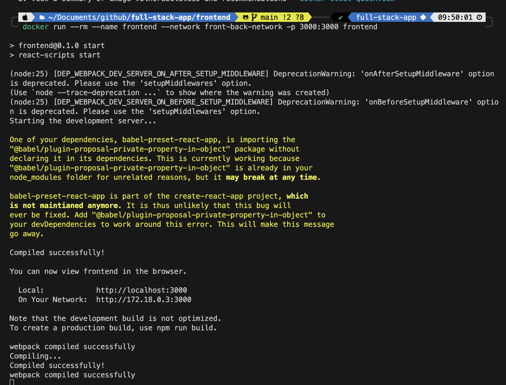

# full-stack-app
Course on Building Full Stack Applications With Python and ReactJS



The backend python and [fastAPI](https://fastapi.tiangolo.com)

With a [React](https://react.dev) frontend

## Steps to get started

1. Install fastapi and uvicorn

```bash
pip install fastapi
pip install "uvicorn[standard]"
```

2. Once installed create a folder called `backend`
3. In that folder create a file called `main.py`
4. Copy this code into the file:

```python
# This is a quick backend server to serve the data for the frontend
from typing import List

from fastapi import FastAPI
from pydantic import BaseModel

app = FastAPI()

# Create a database
class Person(BaseModel):
    id: int
    name: str
    age: int

# Add members to the database
DB: List[Person] = [
    Person(id=1, name="John", age=20),
    Person(id=2, name="Mary", age=21),
    Person(id=3, name="Bob", age=22),
]

# Returns a list of Persons
@app.get("/api")
def read_root():
    return DB

```

5. CD into the backend folder and run this command to start the webserver

```bash 
uvicorn main:app --reload
```

6. Open a browser and navigate to `http://127.0.0.1:8000/api`

>NOTICE: That we have hello world.

7. Open a new terminal and create a React app with `npx create-react-app frontend` and accept.

>NOTE: This creates a folder called frontend.

8. Also install AXIOS with `npm i axios`

>This allows us to issue HTTP request

9. CD into the frontend directory.

10. In the terminal enter `npm start` to start the webserver

11. In the browser open `localhost:3000`

12. Now navigate to **frontend/src/App.js** 

13. Under the function App() remove all of the code after the imports and add:

```js

function App() {
  
  const [people, setPeople] = useState([]);

/* The useState hook is used to store the data that we get back from our backend. */
  useEffect(() => {
    axios.get('/api').then(response => setPeople(response.data));

}, []);

/* The useEffect hook is used to make a request to our backend when the component is rendered. */
return people.map((p, index) => {
  return <p key={index}>{p.id} {p.name} {p.age}</p>
})
}

export default App;
```

14. In the `index.css` file in the body element add the line `text-align: center`; at the end.

15. In App.js at the lines below to get data from the backend:

```js
import axios from 'axios';
/* This allows us to use the axios library to make HTTP requests to our backend. */
import { useEffect, useState } from 'react';
```

16. Next open **/frontend/package.json** and add the line below. This is what will make the proxy connection to the port that the backend listens on. Kill the servers and restart:

```json
"proxy": "http://localhost:8000"
```

>At this point we have a fully functional backend and frontend. Next our goal is to dockerize each component and make them communicate. 

17. Open the backend and create a new file named `Dockerfile` 

18. Add the code below to the Dockerfile:

```Dockerfile
FROM python:3.9
WORKDIR /api
COPY ./requirements.txt /api/requirements.txt
RUN pip install --no-cache-dir --upgrade -r /api/requirements.txt
COPY . /api
CMD ["uvicorn", "main:app", "--host", "0.0.0.0", "--port", "8000"]
```

19. In the terminal run `pip freeze > requirements.txt` to create the requirements file.

>NOTE: Ensure that you have docker desktop running. You can verify with `docker ps` if not run `open -a Docker` 

20. After creating the requirements file and ensuring docker is running run `docker build . -t backend` to build the backend. 

>NOTE: The `.` means use the Dockerfile in this directory and the `-t backend` means tag the build as backend.

21. Verify the image was created with `docker images`

22. To run the image enter `docker run --name backend --rm -p 8000:8000 backend`

>NOTE: This runs the image with the name backend exposing port 8000 from the host to 8000 within the container and using the image backend. Once its running you will see this:



>NOTE: Now if you stop the local terminal of uvicorn then open a browser and enter `http://127.0.0.1:8000/api` you are now accessing the container and not the localhost. --> The backend is now built.

23. Open the frontend and create a new file named `Dockerfile` 

24. Add the code below to the Dockerfile:

```Dockerfile
FROM node:17-alpine
WORKDIR /app
COPY package*.json /app/

COPY . ./

RUN npm i --silent
# This can be found in package.json
RUN npm i -g react-scripts@5.0.1 --silent
RUN npm i axios --silent

CMD ["npm", "start"]
```

>NOTE: Since we don't want to copy everything create a `.dockerignore` file and add the line `node_modules` to not copy that directory. 

25. Inside the **package.json** change line with the name from `"proxy": "http://localhost:8000"` to the name of the backend we built with docker `"proxy": "http://backend:8000"`

26. Now you have to build the frontend image with docker. Open the terminal and run `docker build . -t frontend`

>Now we need to create a docker network for the frontend and backend to communicate. 

27. In the terminal run `docker network create front-back-network` <--- You can name the network anything. Once created you will see a hash. 



28. Now you have to stop the running backend docker container. Run `docker ps` to find the CONTAINER ID and then enter `docker stop CONTAINER ID`

29. Now you can run the container again but this time with the newly created docker network: `docker run --name backend --rm --network front-back-network -p 8000:8000 backend`

>NOTE: The localhost can still access the docker container with `http://localhost:8000/api`



30. Now open the frontend directory and run `docker run --rm --name frontend --network front-back-network -p 3000:3000 frontend`



At this point you can open `http://localhost:3000/` and all of the data is coming from the frontend docker container that is communicating with the backend container. 
